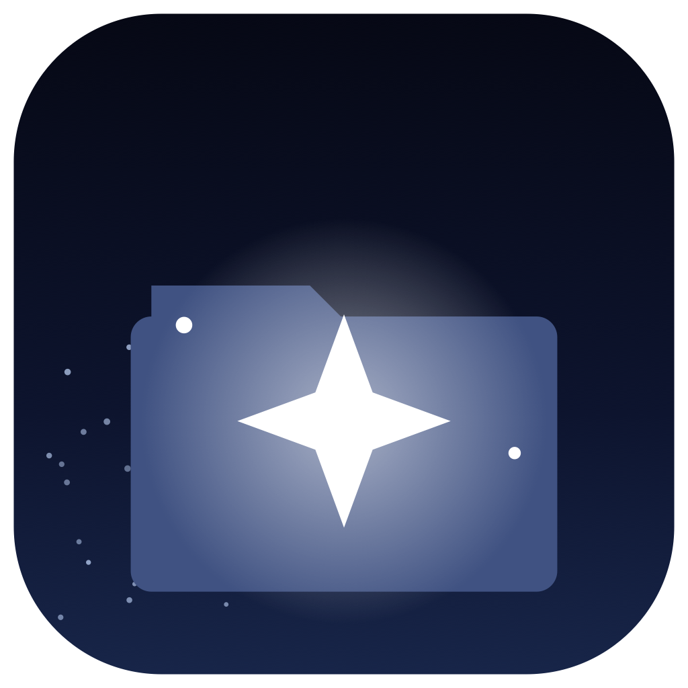

# AstroTool



Asztrofotó-könyvtár auditálása, minőség-pontozás és kalibráció-követés macOS-en — CLI-vel és natív SwiftUI alkalmazással.

## Mit tud

- **Audit** — végigpásztázza a képkönyvtárat, és három súlyossági szintbe sorolja a talált problémákat:
  - **biztos hiba** (`sureError`) — pl. sérült/hiányos FITS fejléc, üres fájl,
  - **gyanús** (`suspicious`) — pl. szokatlan méret/metaadat, ami hibára utalhat,
  - **valószínűleg szándékos** (`probablyIntentional`) — pl. ismert reziduum-minta vagy tudatosan meghagyott fájl.

  Emellett duplikátum-keresés (`--no-duplicates` kikapcsolja), és opcionálisan javaslat-script generálás (`--suggest`).
- **Minőség-pontozás (rate)** — light frame-ek pontozása natív metrikákkal, opcionálisan Siril CLI hibriddel (FWHM, kerekség, csillagszám, háttér), kiugró (outlier) keretek jelölésével.
- **Statisztika (stats)** — célpontonkénti integrációs idő, session-szám, utolsó felvétel dátuma, wide-field/deep-sky besorolás.
- **Kalibráció-hiánylista (calib)** — mely expozíciós idő/hőmérséklet kombinációkhoz van lefedettség (dark/flat/bias), és mihez kell még kalibrációs keretet készíteni.
- **Session-párosítás (match)** — egy adott célpont+dátum session-höz tartozó kalibrációs keretek és light frame-ek összerendelése, problémákkal.
- **Új session létrehozás (new-session)** — kanonikus `YYYY-MM-DD` könyvtárstruktúra és README-sablon létrehozása egy célponthoz.
- **Capture-gyűjtések** — egyetlen célpont/dátum session alatt külön OSC,
  dual-band/NB, expozíciós vagy felszerelés-csomagok saját minőség-,
  kalibráció-, stack- és feldolgozási összesítéssel.
- **Egy-session konverter** — régi `lights_osc`/`lights` struktúra előnézettel
  történő logikai besorolása vagy külön engedélyezett fizikai rendezése,
  pontos fájllistával és visszavonási bizonylattal.
- **Észlelés-tervező (plan)** — ma esti kulmináció, max magasság, láthatósági ablak és Hold-zavarás célpontonként, pontszám szerint rendezve.
- **Kézi setup-látómező (Felfedezés)** — több kamera+optika profil, APS-C/full-frame/egyedi szenzorméret, fix vagy zoom fókusztáv; a célpontok FOV-illeszkedése az éppen kiválasztott valós setupból számolódik.
- **Kereshető éjszaka-napló (search)** — a session `README.txt`-jébe kézzel beírt Bortle/SQM/seeing/megjegyzés szöveg indexelve, kulcs vagy érték szerint kereshetően.
- **Plate-solve backfill (solve)** — wide-field Canon CR3 célpontok koordináta-pótlása Siril blind plate-solve-jával, hogy a tervező és a mozaik-panel követés ezekre is működjön.
- **Expozíció-tanácsadó (expose)** — mért szenzor-zajból és per-Bayer égháttérből számolt ideális sub-hossz + relatív SNR-tanács ("mennyivel javul a jel, ha még N órát integrálok").
- **Stack-lista export (stacklist)** — egy session legjobb frame-jeinek kiválasztása (pontszám + DSS-verdikt alapján) és exportálása hardlinkek + `.dssfilelist` + Siril `.ssf` script formájában, közvetlenül a DeepSkyStacker/Siril/Sirilic munkafolyamathoz.

## ⛔ Biztonsági vasszabály

**Az audit, pontozás, riport és normál könyvtárműveletek nem törlik és nem
mozgatják a képfájlokat.** Az audit kizárólag jelöl, és kérésre átnézhető
javaslat-scriptet készít. Az egyetlen szándékos kivétel a v0.15.0 explicit
**Session átalakítása gyűjtésekre** műveletének fizikai módja: ez mindig egy
konkrét célpont+dátum sessionre zárt, előbb tételes forrás→cél előnézetet
mutat, felülírást nem enged, külön megerősítést kér, bizonylatot készít és
visszavonható. Az alapértelmezett logikai mód egyetlen képfájlt sem mozgat.

## Telepítés

1. Töltsd le a legfrissebb DMG-t a [Releases](../../releases) oldalról.
2. Nyisd meg a DMG-t, és húzd az `AstroTool.app`-ot az `Applications` mappába.
3. **Első indításkor jobbklikk → Megnyitás** az app ikonján (nem az egyszerű dupla kattintás!) — az app nincs notarizálva (nincs Apple Developer fiók mögötte), így Gatekeeper alapból blokkolná egy sima dupla kattintást.

### CLI telepítése

Kétféleképpen:

- **Release zip**: töltsd le az `astrotool.zip`-et a Releases oldalról, csomagold ki, majd tedd a `PATH`-ra (pl. `mv astrotool ~/.local/bin/`).
- **Forrásból**: `./build.sh` — ez a helyi gépen build-eli az appot és a CLI-t, majd a CLI-t automatikusan tükrözi `~/.local/bin/astrotool` névvel (szimlink), az appot pedig `~/Applications`-be másolja.

## Teljes lemez-hozzáférés (TCC)

A képkönyvtár egy külső köteten van (`/Volumes/images/Astro`), ehhez macOS **Teljes lemez-hozzáférés** jogosultság kell:

1. **Rendszerbeállítások → Adatvédelem és biztonság → Teljes lemezhozzáférés**
2. Engedélyezd az `AstroTool.app`-nak (illetve a terminálnak, ha a CLI-t onnan futtatod).
3. **Indítsd újra az appot/terminált** az engedélyezés után — enélkül a jogosultság nem lép életbe.

Ha a hozzáférés hiányzik vagy a kötet nincs csatlakoztatva, a CLI **exit code 2**-vel tér vissza, és útmutató szöveget ír a hibakimenetre; az app pedig egy dedikált képernyőt mutat ugyanezzel az útmutatással a fő felület helyett.

## CLI használat

Minden alparancs támogatja a `--json` kapcsolót gépi olvasható kimenethez (snake_case kulcsok, rendezett, pretty-printed).

```bash
astrotool scan --root /Volumes/images/Astro
# Bejárja a könyvtárat, frissíti a belső SQLite indexet (hozzáadott/frissült/változatlan/hiányzó fájlok).

astrotool audit --suggest --include-suspicious
# Lefuttatja az audit szabálymotort, és javaslat-scriptet ír a gyanús találatokra is (alapból csak a biztos hibákra).

astrotool audit --no-duplicates --json
# Audit duplikátum-keresés nélkül, JSON kimenettel (pl. szkriptből feldolgozáshoz).

astrotool rate --target M31 --date 2026-03-15
# Az adott célpont/dátum light frame-jeinek minőség-pontozása (Siril, ha elérhető).

astrotool rate --target M31 --no-siril
# Pontozás csak natív metrikákkal, Siril nélkül.

astrotool stats --target M31
# Integrációs idő, session-szám, utolsó felvétel, wide-field státusz egy célponthoz.

astrotool stats
# Statisztika az összes célpontra táblázatos formában.

astrotool calib
# Kalibrációs lefedettség és hiánylista (mely expozíció/hőmérséklet kombinációhoz kell még dark/flat/bias).

astrotool match --target M31 --date 2026-03-15
# Egy adott session light/flat/dark/bias készletének összerendelése és a talált problémák listája.

astrotool new-session --catalog M --name 31 --date 2026-03-15
# Új session könyvtár létrehozása (YYYY-MM-DD) README sablonnal a célponthoz.

astrotool capture create --target IC_1396 --date 2026-08-08 \
  --name "SV220 · 300 s" --slug sv220-300s --sensor osc \
  --signal dual_band --filter-maker SVBONY --filter-model SV220
# Első osztályú capture-gyűjtés létrehozása egy meglévő sessionben.

astrotool session-convert plan --target IC_1396 --date 2026-08-08
# Csak előnézet: felismerés, bizonytalanságok és pontos műveleti összegzés;
# alapból nincs fájlmozgatás.

astrotool config show
# A jelenleg érvényes (fájlból betöltött + alapértelmezésekkel kiegészített) konfiguráció kiírása.

astrotool config path
# A config.json elérési útjának kiírása.

astrotool plan
# Ma esti észlelési terv: célpontonként megvan/hiányzó óra, kulmináció, láthatósági ablak, Hold-zavarás, verdikt.

astrotool export --target M31 --format astrobin
# AstroBin bulk-import CSV a célpont TRUE (dedupolt) acquisition-adataiból, .astro_tool/exports/ alá írva.

astrotool solve --target M_Milky_Way --frames 2
# Koordináta nélküli (pl. Canon CR3) célpont session-jeinek plate-solve-olása Sirillel, session-önként max 2 kerettel.

astrotool solve --all --json
# Minden koordináta nélküli célpont megoldása, gépi olvasható összegzéssel.

astrotool stacklist --target M31 --date 2026-03-15
# A session legjobb frame-jeinek kiválasztása és exportálása (hardlinkek + .dssfilelist + .ssf) DSS/Sirilbe töltéshez.

astrotool stacklist --target IC_1396 --date 2026-08-08 --capture sv220-300s
# Csak egy capture-gyűjtés külön stacklistája.

astrotool report --target M31 --date 2026-03-15
# Önmagában megnyitható HTML éjszaka-riport (.astro_tool/reports/ alá írva).

astrotool plan --month
# 30 éjszakás tervező-naptár: sötét óra, Hold%, éjszakánként a top 3 célpont.
```

Minden parancs elfogadja a `--root <PATH>` kapcsolót az alapértelmezett könyvtár felülbírálására.

## Képalkotó setupok és látómező

Az alkalmazás **Beállítások ▸ Felszerelés** lapján névvel menthető minden
kamera + objektív/távcső kombináció. A szenzor valódi szélessége és magassága
milliméterben, valamint a fókusztáv határozza meg a látómezőt; crop-faktort nem
kell számolni.

A **Setup hozzáadása** menü közvetlen sablont ad három gyakori workflow-hoz:

- APS-C dedikált asztrokamera + 100–400 mm zoom;
- Canon R8 (nem modolt, full frame) + 16 mm;
- Canon R8 (nem modolt, full frame) + 28–70 mm zoom.

Minden sablon szabadon átírható. A szenzorpresetek: tipikus APS-C
`23,5 × 15,7 mm`, Canon APS-C `22,3 × 14,9 mm`, full frame `36 × 24 mm`,
illetve tetszőleges egyedi méret.

A **Felfedezés** felső sorában választható ki az aktív setup. Zoomobjektívnél
a mellette lévő mm-gombbal állítható be a konkrét tervezési fókusztáv, majd az
„Alkalmazás és újraszámítás” gomb frissíti a FOV-ot; minden
„befér / mozaik kellene / túl kicsi” címke ehhez számolódik újra.
A választott setup és a legutóbbi zoomállás setup-onként megmarad.

## Több capture egy sessionben

A session továbbra is a célpont+dátum pár: például
`IC_1396/2026-08-08`. Alatta tetszőleges számú, beszédes **capture-gyűjtés**
élhet, így ugyanazon az éjszakán külön kezelhető például:

- `OSC · 30 s · szűrő nélkül`;
- `OSC · SVBONY SV220 · 300 s · dual-band`;
- egy másik kamera, binning, optika vagy expozíciós stratégia.

Az új kanonikus fa:

```text
sessions/<cél>/<dátum>/captures/<slug>/lights
sessions/<cél>/<dátum>/captures/<slug>/flats
sessions/<cél>/<dátum>/captures/<slug>/darks
sessions/<cél>/<dátum>/captures/<slug>/biases
stacks/<cél>/<dátum>/<slug>
processed/<cél>/<dátum>/<slug>
```

Az alkalmazásban a Célpont-részletek ▸ Sessionök sor alatt capture-kártyák
mutatják a külön keretszámot, integrációt, expozíciókat, filtert,
kalibrációt, stackeket és process eredményeket, miközben a session teljes
összesítése is megmarad. A Minőség táblában több frame kijelölhető, majd az
**Capture-besorolás…** ablakban egy fájlra, kijelölésre, mappára, azonos
expozícióra vagy a teljes sessionre alkalmazható a gyűjtés és a pontos
OSC/NB/filter metadata. A mentés előtti nézet tételesen megmutatja, mi
változik és honnan származik az érték.

A session sor **Átalakítás…** gombja egy pontosan erre a sessionre zárt
háromlépcsős konvertert nyit. A logikai mód a régi mappákat a helyükön
hagyja; a fizikai mód csak az előnézetben felsorolt fájlokat mozgatja. A
bizonytalan flat/stack besorolást kötelező feloldani, az alkalmazás után
pedig a bizonylatból visszaállítható az eredeti állapot.

Ha nincs kézi setup, a korábbi működés változatlan: a program a könyvtár
domináns felszerelésének WCS/pixelskála adataiból próbál medián FOV-ot
felismerni. `n/a` csak akkor jelenik meg, ha sem kézi profil, sem használható
automatikus adat nincs; ilyenkor a **Setup beállítása…** gomb közvetlenül a
Felszerelés lapra visz.

## Tervező

Az `astrotool plan` a meglévő adatokból (light frame-ek `header_json`-ja +
opcionális `goal:<óra>h` tag) minden ismert célponthoz megmutatja, hogy
**ma este** érdemes-e rááldozni időt:

```bash
astrotool plan --min-alt 25 --date 2026-08-10
```

```
Ma este: szürkület 22:30 -> hajnal 03:10, Hold: 73%
CÉLPONT        MEGVAN   CÉL      KULMINÁCIÓ  MAX ALT  ABLAK          HOLD        VERDIKT
M31_Andromeda  0:05     —        03:10       74°      22:44–03:10    32°/73%     Hold zavar (32°, 73%)
```

- **Koordináták**: a célpont RA/Dec-je a session light frame-ek plate-solve
  `CRVAL1`/`CRVAL2` fejlécéből (ASIAIR-lightokon szinte mindig jelen van),
  vagy `RA`/`DEC` fallback kulcsokból (szám vagy szexagezimális `H M S`/
  `D M S` forma is jó) — a session lightok mediánja. Koordináta nélküli
  célpont "nincs koordináta" verdikttel jelenik meg, sky-adat nélkül.
- **Helyszín**: `config.json`-ban `site.latitudeDeg`/`site.longitudeDeg`
  felülbírálható; ha üres, a könyvtárban talált `SITELAT`/`SITELONG`
  fejlécek mediánjából számolódik automatikusan (csak memóriában, sosem
  íródik vissza a configba). A `plan` emberi kimenete **soha nem írja ki**
  a helyszín koordinátáit — ha ezekre kíváncsi vagy, azt csak az
  `astrotool config show` mutatja meg (az helyi, nem osztott kimenet).
- **Cél**: a célpont-szintű `goal:<óra>h` tag (pl. `astrotool tag add
  --target M31 goal:8h`) adja meg, mennyi integrációt szeretnél összesen —
  ennek hiányában a "CÉL" oszlop `—`.

### Havi tervező naptár

`astrotool plan --month` a napi tervet 30 éjszakára tágítja ki egy
áttekintő táblázattá:

```bash
astrotool plan --month --nights 14
```

```
   DÁTUM       SÖTÉT ÓRA  HOLD%   LEGJOBB CÉLPONTOK
▲ 2026-08-10  6.2        12%   M31 (5.8h), NGC7000 (4.1h)
  2026-08-11  6.1        20%   M31 (5.6h)
  2026-08-12  n/a        28%   -
      nincs csillagászati éjszaka -- nautikus szürkület alapján számolva
```

- **Sötét óra**: a VALÓDI csillagászati éjszaka (Nap -18° alatt) hossza;
  `n/a` + magyarázó sor, ha az éjszaka csak nautikai szürkületig sötétedik
  (nyári, magas szélességi fokú éjszaka), vagy egyáltalán nem sötétedik be
  ("fehér éjszaka").
- **Legjobb célpontok**: a top 3 célpont a `(magasság ≥ --min-alt) ∩ (sötét
  ablak) ∩ (Hold rendben: szeparáció ≥ 40° VAGY megvilágítás < 60%)`
  átfedés szerint, csökkenő sorrendben. A Hold-veto nem csökkenti, hanem
  NULLÁZZA az adott célpont aznapi óráit — vagy zavar, vagy nem.
- **▲ kiemelés**: legalább 4 óra sötét ÉS 30% alatti Hold-megvilágítás
  esetén.
- A havi szken 10 perces mintavétellel fut (a napi `plan` 2 perces
  felbontásához képest szándékosan durvább — havi tervezéshez elég pontos,
  és így `éjszaka × célpont × minta` mérete olcsó marad).
- Az alkalmazásban a "Ma este" doboz "Hónap…" gombja nyitja meg ugyanezt
  egy listaként.

## Exportálás

Egy célpont publikálásához az `astrotool export` egyetlen paranccsal
előállítja a TRUE (dedupolt, `_hibas`-kizárt) számokból az acquisition-
riportot, három formátumban:

```bash
astrotool export --target M31 --format astrobin
# date,filter,number,duration,binning,gain,sensorCooling,darks,flats,flatDarks,bias,bortle,meanSqm
# 2026-03-15,L-eXtreme,42,300,,100,-10,4,6,2,4,4,20.8
# 2026-03-16,L-eXtreme,18,300,,100,-10,3,6,0,4,,

astrotool export --target M31 --format csv --out -
# Gazdagabb, session-önkénti CSV (frames_usable, integration_s, kamera,
# gain/ISO, FWHM medián, háttér e-/s/arcsec², címkék stb.), stdoutra.

astrotool export --target M31 --format md
# Emberi session-napló Markdownban (.astro_tool/exports/ alá írva).
```

- `--format astrobin`: AstroBin "long acquisition" bulk-importjához pontos
  fejléccel, session×szűrő×nominális-expozíció csoportonként egy sorral és
  soronként saját, normalizált név alapján feloldott filter-ID-val. A
  `_hibas`-kizárt session-ök teljesen kimaradnak (nem szabad publikálni
  őket); a `binning` oszlop mindig üres, mert a light-oldali binning ma
  nincs elmentve (sosem tippel `1`-et).
- `--format csv`: általánosabb, session-önkénti CSV minőség-adatokkal
  (`SessionQuality`-vel joinolva) és címkékkel — teljes napló, a kizárt
  session-ök is szerepelnek benne.
- `--format md`: emberi, magyar címkéjű session-napló — célpont-fejléc,
  session-önkénti alszakaszok, záró összegzés (session-szám, integráció,
  cél haladás % ha van `goal:Xh` tag).
- `--out -` a tartalmat stdoutra írja fájl nélkül; `--out PATH` a
  könyvtáron KÍVÜLI tetszőleges útvonalra ír. `--out` nélkül az eszköz
  `.astro_tool/exports/<célpont>-<időbélyeg>.<csv|md>` alá ír és kiírja az
  útvonalat. Az alkalmazásban a Statisztika fül célpont-sorának Műveletek
  cellájában az "Exportálás…" menü ugyanezt teszi, Finder-reveal-lel.
- Az `astrobin` sorok `bortle`/`meanSqm` oszlopa a session `README.txt`-jébe
  írt jegyzetekből töltődik ki (lásd lentebb "Kereshető napló") — üresen
  marad, ha a session-nek nincs ilyen jegyzete.

## Kereshető napló

A Bortle-osztály, SQM, seeing, harmatképződés vagy egyéb megjegyzés soha nem
kerül FITS fejlécbe — de a `new-session` által létrehozott `README.txt`
"Fill in metadata" szakasza pontosan erre való. Egy scan minden session
`README.txt`-jét beolvassa (`Kulcs: érték` sorok, üres érték kihagyva), és
kereshetővé teszi:

```bash
astrotool search bortle
# M31_Andromeda [2026-03-15]
#   Location/Bortle: falu, 4

astrotool search sqm --json
```

- A keresés a kulcsban ÉS az értékben is néz (case-insensitive `LIKE`).
- Bármilyen egyéni kulcs indexelődik, nem csak a sablon mezői — pl. egy
  kézzel hozzáadott `SQM: 20.8` sor is kereshető lesz.
- Az app Statisztika fülén a session-sor "README" jelvényén hover-tooltip
  mutatja az összes kiolvasott `kulcs: érték` sort.
- `--refresh-meta` egy már korábban beszkennelt, de még jegyzet nélküli
  session `README.txt`-jét is újraolvassa (pl. R6-4 előtti scan után).
- A fájlt a scan CSAK OLVASSA — sosem ír bele.

## Plate-solve backfill

Az ASIAIR FITS lightok szinte mindig plate-solve-oltak (`CRVAL1`/`CRVAL2` a
fejlécben) — de egy wide-field Canon CR3 célpontnak nincs is FITS fejléce,
így a `plan`/`panels` "nincs koordináta"-t ad rá. Az `astrotool solve`
Sirillel blind plate-solve-olja a koordináta nélküli usable lightokat:

```bash
astrotool solve --target M_Milky_Way --frames 2
# session-önként legfeljebb 2, koordináta nélküli keret megoldása (alapból 1)

astrotool solve --all
# minden koordináta nélküli célpont bejárása

astrotool solve --target M_Milky_Way --force
# már megoldott célpont ÚJRA-solve-olása is (a régi koordináta felülíródik)
```

- **Siril kell hozzá** (`siril-cli`, `config.json`-ban `rating.sirilPath`
  alatt, ugyanaz a beállítás, amit a `rate` is használ). Hiányában exit 1,
  világos hibaüzenettel.
- **A könyvtár fájljaihoz sosem nyúl**: a Siril munka mindig egy ideiglenes
  scratch könyvtárban zajlik (`cd` oda, `load` az EREDETI fájlt csak
  olvasva, `platesolve`, `save` a scratch könyvtárba) — az eredmény kizárólag
  a `fits_meta.solved_ra`/`solved_dec`/`solved_scale_arcsec`/
  `solved_rotation_deg` oszlopokba kerül, a `header_json` (az eredeti
  szkennelt fejléc) és maga a fájl érintetlen marad.
  Session-önként csak néhány reprezentatív keretet old meg (alapból 1,
  `--frames N`-nel állítható) — nem a session összes keretét, ami feleslegesen
  lassú lenne.
- A `plan`/`panels` a fejléc WCS-ét részesíti előnyben, és csak akkor esik
  vissza a solved oszlopokra, ha a fejléc (vagy annak hiánya) nem ad
  koordinátát — egy már ASIAIR-plate-solve-olt frame-et a `solve` sosem ír
  felül feleslegesen (`--force` nélkül a meglévő koordinátájú kereteket
  kihagyja).
- Az alkalmazásban a Statisztika fül célpont-sorának Műveletek cellájában a
  "Plate-solve…" gomb csak koordináta nélküli célpontokon jelenik meg.

## Expozíció-tanácsadó

Mennyi legyen egy sub hossza? Az `astrotool expose` a mért szenzor-adatokból
(`astrotool sensor --measure` bias-szintje/leolvasási zaja/EGAIN-je) és a
mért per-Bayer háttérből (`astrotool rate`, R7-B1 óta) számolja ki, nem
találgatja:

```bash
astrotool expose --target NGC7000
```

```
Célpont: NGC7000
Session: 2026-07-18
Kamera: ASI2600MC · gain 100
Setup: ASI2600MC·530mm·3.76µm·RGGB
Jelenlegi sub: 120.0 s
Leggyengébb csatorna: B (0.0810 e⁻/s/px)
Ideális sub (elméleti): 203.6 s
Ajánlott sub: 203.6 s
Rövidebb alternatíva (C=10%): 99.4 s
Összes használható integráció: 6.40 óra
Tanács:
  - a mért égháttér mellett ~204 s az ideális sub (most 120 s — a leolvasási
    zaj a keret zajának 8%-a)
  - +3 h → relatív SNR ×1,21; a következő +10%-hoz 1,34 h kell
```

`--target` nélkül egy sor/célpont kompakt táblázat (`astrotool expose
--json` a teljes szerkezethez).

- **A matek**: a leggyengébb (legalacsonyabb mért égi-fotonrátájú) csatorna
  határozza meg az ideális sub-hosszt — `t = R² / (B × ((1+C)² − 1))`, ahol
  `R` a mért leolvasási zaj (e⁻), `B` a mért égháttér-ráta (e⁻/s/px) és `C`
  (alapból 5%) azt mondja meg, mennyivel engedjük a leolvasási zajt
  megnövelni a tiszta foton-zaj felett — ez megegyezik Glover ökölszabályával
  ("az égháttér legyen ≥10×R²"). A `C=10%` variáns ("rövidebb subok, kicsit
  több zaj") mindig kiszámolva mellette.
- **Sapkák**: `expose.maxSubSeconds` (alapból 300 s — guiding-pontosság és
  műhold-csík kockázat nő a hosszal, függetlenül attól, mit mond a tiszta
  zaj-matek), és egy szaturáció-sapka (ha a session medián szaturált
  pixelaránya a JELENLEGI sub-hosszon már 0,1% fölött van, sosem javasol
  hosszabbat, mint a jelenlegi). Amikor a sapka közbeszól, a tanács ezt
  őszintén jelzi ("elméletileg N s, de guiding/műhold-kockázat miatt nem
  javasolt").
- **Relatív SNR**: nem igényel égháttér-adatot, csak a célpont eddigi
  használható integrációját (a DOMINÁNS setup-fingerprint kereteire
  szűkítve, hogy egy eszközváltás ne torzítsa a számot) — "+3 óra → relatív
  SNR ×1,21-szoros", és mennyi idő kell a következő +10%/+5%
  SNR-nyereséghez.
- **Őszinte n/a**, sosem hibás szám: nincs mért szenzor-profil a
  kombóhoz → "nincs szenzor-profil — futtasd: astrotool sensor --measure";
  a keretek a per-Bayer háttér bevezetése előtt lettek pontozva → "futtasd
  újra: astrotool rate"; a kamerának nincs `BAYERPAT` fejléce (mono/DSLR,
  pl. Canon) → a funkció csak színes (Bayer) ASI-szenzorokhoz készült,
  ezt őszintén megmondja.
- Az alkalmazásban a Minőség fülön a session-összegzés fölött egy
  "Expozíció-tanácsadó" doboz mutatja ugyanezt a kiválasztott célpontra.

## Stack-lista

Híd a keret-pontozás (`astrotool rate`, DSS-verdiktek) és a tényleges
stackelés között: kiválasztja egy session legjobb frame-jeit, és olyan
formában teszi le őket, ahogy a valódi eszközök (DeepSkyStacker +
Siril/Sirilic) beolvassák.

```bash
astrotool stacklist --target M31 --date 2026-03-15 --keep 0.8
```

```
target: M31
date: 2026-03-15
összes használható: 42
kiválasztva: 34
szempontok:
  - használható (deduplikált, nem elvetett) light: 42
  - DSS-ben elvetett: 3
  - kiugróan gyenge: 1
  - nem pontozott: 5 — megtartva
  - megtartva: 34 / 38 (keepFraction 80%)
exportálva: /path/to/library/.astro_tool/stacklists/M31-2026-03-15
```

- **Miért nem "stackeld ezt a listát"**: Siril 1.4-ben nincs ilyen parancs,
  és a szekvencia-index alapú select/unselect törékeny egy átrendezéssel
  szemben. Ehelyett a kiválasztott lightokat egy külön mappába
  HARDLINKELI (`.astro_tool/stacklists/<cél>-<dátum>/lights/` — additív,
  a te eredeti fájljaidhoz sosem nyúl), és afölé egy sima
  `convert`/`register`/`stack` Siril-scriptet ír.
- **Kiválasztás**: a `FrameSet` usable (dedupolt, nem `Reject/`)
  lightjaiból hard drop, ami a DSS-ben elvetett (`.dssfilelist`
  `CHECKED=0`) és a kiugróan gyenge (a mért `score` a session átlagától
  `outlierZScore`-nál jobban lemarad) kereteket kiszűri; a maradékból
  `--keep` (alapból 80%, sosem kevesebb 3 keretnél, ha van elég) a
  legjobban pontozottakat tartja meg. Egy pontozatlan keret (még sosem
  futott rá `astrotool rate`) SOSEM esik ki emiatt — a hiányzó adat nem
  bizonyíték a gyenge keretre, mindig megtartva.
- **Mit ír**: a hardlinkelt `lights/` mappa mellé egy `.dssfilelist`-et
  (DeepSkyStacker/Sirilic közvetlenül beolvassa — csak a kiválasztott
  frame-ek szerepelnek benne, `CHECKED=1` sorokkal) és egy `.ssf`
  Siril-scriptet (fejléc-kommenttel, hogy a kalibráció-mestereket saját
  kézzel illeszd be a `convert`/`register` közé, ha a session-nek kell —
  a script sosem tartalmaz `rm`-et vagy más destruktív parancsot,
  áttekintésre szánva, akárcsak az audit javaslat-script).
- Nincs `--dry-run`/`--yes` kapu: mind a kiválasztás, mind az export
  additív, idempotens (egy már meglévő hardlinket sosem bont/ír felül) és
  csak-olvasás a te eredeti fájljaidon, ezért a parancs mindig lefut és
  beszámol.
- Az alkalmazásban a Statisztika fül session-sorának Műveletek cellájában
  a "Stack-lista…" gomb nyit egy sheetet megtartás-csúszkával (50–100%) és
  élő szempont-előnézettel; az "Exportálás" gomb után a Finder megnyitja a
  létrehozott mappát.

## Éjszaka-riport

Egy session mindenre kiterjedő, önmagában megnyitható HTML "report card"-ja
— tisztán a már meglévő lekérdezések összefésülése, plusz két új
számítás, amit eddig semmi más nem mutatott meg:

```bash
astrotool report --target M31 --date 2026-03-15
# .astro_tool/reports/M31-2026-03-15.html

astrotool report --target M31 --date 2026-03-15 --out -
# a HTML stdoutra, fájl írása nélkül
```

- **Tartalma**: fejléc (célpont, dátum, setup), összefoglaló számok (ablak,
  integráció, hatékonyság%, usable/elvetett/link keretek), idővonal
  (szünet-lista + egyszerű CSS-sávos vizualizáció, JS nélkül), minőség
  (FWHM, háttér, rang, kiugrók, expozíció-tanácsadó mondatok ha vannak),
  magasság & Hold, hardver (hűtő/fókusz verdikt), kalibráció
  (flat/dark/bias státusz + eltérés-okok), DSS-verdiktek és README-jegyzetek
  (ha vannak), és a célpont teendő-listája.
- **Magasság & Hold** (új, eddig sehol nem volt meg): a session usable
  lightjainak `DATE-OBS`-ából a célpont magassága az adott pillanatban
  (`AltAz` + `SiderealTime`, koordináta `TargetCoordinates`-ből — plate-solve
  fallback-kel is) → min/medián/max magasság és "a keretek N%-a készült 30°
  alatt"; plusz a session ablaka alatt VALÓBAN elért Hold-geometria (Hold
  megvilágítása az ablak közepén, medián target-Hold szeparáció, Hold max.
  magassága induláskor/középidőben/végén). Koordináta vagy helyszín
  hiányában a szakasz megmarad, csak egy magyarázó megjegyzéssel a számok
  helyén — sosem hasal el, sosem tippel.
- Egyetlen fájl, beágyazott CSS, nincs `<script>` és nincs külső erőforrás
  — bármelyik böngészőben, internet nélkül is megnyílik.
- Az alkalmazásban a Statisztika fül session-sorának Műveletek cellájában
  az "Éjszaka-riport" gomb a háttérben elkészíti, majd a rendszer
  alapértelmezett böngészőjében megnyitja.

## Célpont-riport

Az Éjszaka-riport mintájára, de EGY célpont TELJES történetéről — minden
session, minden stack, minden kalibráció-státusz egy lapon:

```bash
astrotool target-report --target M31
# .astro_tool/reports/target-M31.html

astrotool target-report --target M31 --out -
# a HTML stdoutra, fájl írása nélkül
```

- **Tartalma**: fejléc (feloldott név + mappanév + katalógus-designáció,
  RA/Dec óra/fok-formátumban a forrással, setup-fingerprint(ek), goal-tag és
  wide-field jelző), összkép (usable/gross integráció, keret-bontás,
  session-szám, első–utolsó dátum, pipeline-fázis + teendők), sessionök
  táblázata (mindegyik saját sorban: keret/integráció/expozíció/kamera/
  gyújtótáv/gain/hőm./szűrő + README/DSS/kizárt jelzők — és ha az adott
  éjszakának már van saját Éjszaka-riportja, "van éjszaka-riport" jelzés),
  minőség-táblázat rang-kiemeléssel + expozíció-tanácsadó mondatok,
  felderített stackek (legjobb kiemelve), kalibráció (session-szintű +
  flat-higiénia), mozaik-panelek (ha van), tervezés (mai láthatóság/verdikt/
  Hold, goal-hiány, +10% relatív SNR költsége), és README-jegyzetek
  session-önként.
- Minden szekció-fejléc mindig megjelenik, akkor is, ha az adott célponthoz
  nincs mit mutatni — hiányzó adatnál egy magyarázó megjegyzés lép a
  táblázat helyére, a riport szerkezete sosem függ attól, mi van pontosan
  felderítve.
- Egyetlen fájl, beágyazott CSS (ugyanaz a dark theme, mint az
  Éjszaka-riporté), nincs `<script>` és nincs külső erőforrás.
- Az alkalmazásban a Statisztika fül célpont-sorának "Exportálás…" menüjében
  a "Célpont-riport" tétel a háttérben elkészíti, majd megnyitja a rendszer
  alapértelmezett böngészőjében.

## Konfiguráció

A konfiguráció a `<ROOT>/.astro_tool/config.json` fájlban van; hiányzó kulcsok esetén az eszköz beépített alapértékeket használ, így egy régebbi config fájl is mindig érvényes marad.

| Kulcs | Jelentés |
|---|---|
| `rootPath` | A képkönyvtár gyökere (alapértelmezés: `/Volumes/images/Astro`). |
| `excludedDirNames` | Könyvtárnevek, amelyeket a scan teljesen kihagy (pl. `tools`). |
| `excludedPaths` | Gyökérhez képest relatív, konkrét kizárt útvonalak. |
| `residuePatterns` | Glob-minták, amelyek "szándékos maradvány" fájlokat jelölnek (pl. `*.seq`, `*_conv*`, `.DS_Store`). |
| `residueDirNames` | Könyvtárnevek, amelyek tartalma reziduumnak számít (pl. `process`). |
| `intentional` | Session-dátum minták, amelyeket az eszköz szándékosnak ismer fel: `runSuffix` (pl. `-2` végű dátum), `dateRange` (két dátum összekötve), `labels` (ismert szöveges címkék, pl. `hibas`, `OSC`). |
| `wideField` | Wide-field/deep-sky besorolás szabálya: `extensions`, `maxFocalLengthMM`, `nameMarkers`, és célpontonkénti `overrides`. |
| `calib` | Kalibráció-illesztés tűrései: `tempToleranceC`, `exposureToleranceS`, `darkMaxAgeMonths` (mikor számít elévültnek egy dark). |
| `rating` | Minőség-pontozás beállításai: `workers` (párhuzamos worker-ek száma), `outlierZScore`, `sirilPath`, `weights` (metrikánkénti súlyok: `fwhm`, `roundness`, `starCount`, `background`). |
| `site` | A tervező (`astrotool plan`) helyszín-felülbírálása: `latitudeDeg`/`longitudeDeg`. Üresen hagyva a könyvtár `SITELAT`/`SITELONG` fejléceinek mediánjából származik. |
| `expose` | Az expozíció-tanácsadó (`astrotool expose`) beállításai: `maxSubSeconds` (alapból 300 — sapka az ajánlott sub-hosszra), `noiseContributionC` (alapból 0.05 — mennyi extra leolvasási zajt engedünk a tiszta foton-zaj felett). |

## Fejlesztés

```bash
swift build            # debug build
swift test              # teljes teszt-szuit (214 teszt)
./build.sh              # release build + app bundle + DMG + CLI zip
```

Projektstruktúra dióhéjban:

- `Sources/AstroCore/` — a teljes üzleti logika (scan, audit, rate, stats, calib, match, new-session, config, write-guard) mint könyvtár, UI-tól függetlenül.
- `Sources/astrotool/` — a parancssori felület (`ArgParser`, `Commands`, `main`), amely csak `AstroCore`-ra épít.
- `Sources/AstroToolApp/` — a SwiftUI alkalmazás (`AppState` + `Views/`), szintén `AstroCore`-ra épülve.
- `Tests/AstroCoreTests/` — a teszt-szuit.
- `icon/`, `build.sh` — app-ikon generálás és a release-csomagolás.

## Licenc

MIT — lásd a [LICENSE](LICENSE) fájlt.
